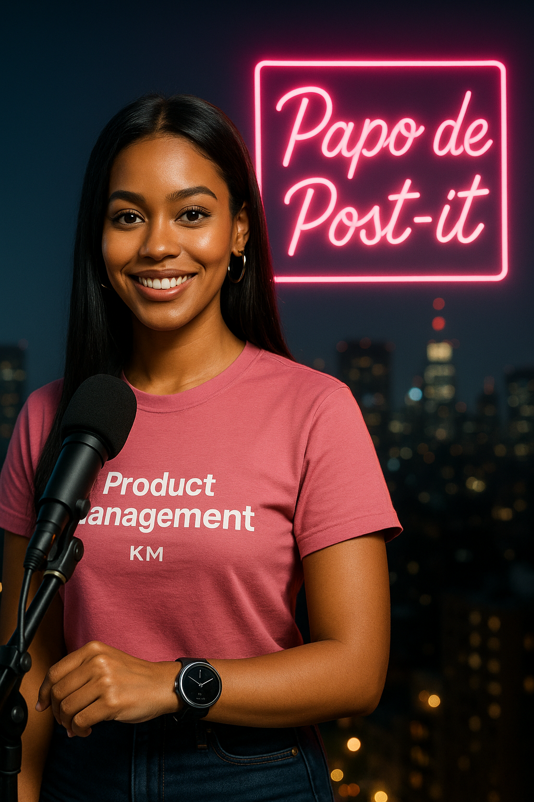

  

  
  

---

<h1 align="center">🎙️ Projeto: Podcast Gerado por I.A.s</h1>

  🚀 Desenvolvido por <strong>Karine Meireles</strong> como parte do desafio do bootcamp da <a href="https://dio.me/">DIO</a>.

---

  <strong>🔊 Preview do podcast:</strong>  
  <audio src="output/podcast_editado_1.0.mp4" controls title="Podcast editado"></audio>

---

## 🧠 Sobre o Projeto

Este repositório reúne todas as etapas da criação de um podcast 100% gerado com o apoio de Inteligências Artificiais, durante um desafio da [DIO](https://dio.me/).  

O objetivo foi mostrar como utilizar IA de forma criativa e prática para desenvolver roteiros, áudios, visuais e edição com ferramentas acessíveis.

---

## 🔧 Ferramentas Utilizadas

- 🤖 **[ChatGPT](https://chat.openai.com/):** geração de roteiros inteligentes e envolventes.  
- 🗣️ **ElevenLabs:** conversão do roteiro em narração com vozes realistas.  
- 🎨 **[Sora](https://sora.chatgpt.com/):** criação de imagens conceituais.  
- 🎧 **[CapCut](https://www.capcut.com/pt-br/):** edição final do áudio e trilhas sonoras.  
- 🖼️ **Sora:** para criação das capas visuais.

---

## 🛠️ Como Reproduzir o Projeto

Siga este passo a passo para criar seu próprio podcast com IA:

### 1. ✍️ Geração de Roteiro  
Use os prompts fornecidos [ChatGPT](KarineMeireles/prompts-for-podcast-generate-by-ia/src/prompts/chatgpt.md) e gere um roteiro com o ChatGPT.

### 2. 🎙️ Criação de Áudio  
Leve o roteiro até o ElevenLabs e gere a narração em áudio.

### 3. 🎨 Criação Visual  
Use o Sora ou MidJourney para criar uma capa bacana para seu podcast.

### 4. 🎧 Edição Final  
Edite o áudio e finalize a produção no [CapCut](https://www.capcut.com/editor).

---

## 📚 Materiais Úteis

- 🎬 [Editor de Áudio - CapCut](https://www.capcut.com/editor?from_page=landing_page&__action_from=picture_V%C3%ADdeos%20profissionais%20em%20minutos,%20n%C3%A3o%20em%20horas.)

> 🔗 Em breve: link para os prompts organizados no Notion.

---

## 👩‍💻 Sobre a Criadora

  

    <strong>Karine Meireles</strong> 
    Profissional em transição para área de Produto e apaixonada por inovação. 
    Explorando o poder das IAs para criar projetos reais e aplicáveis.  
      
    🔗 <a href="https://github.com/karinemeireles">GitHub</a> |
    <a href="https://www.linkedin.com/in/karinelameireles">LinkedIn</a>
  

 

---

## 🙌 Agradecimentos

Projeto inspirado por uma live incrível do instrutor **Felipão** durante o bootcamp da DIO.

Agradeço à comunidade por proporcionar desafios práticos que nos tiram da zona de conforto e nos fazem crescer! 💜

---

  Feito com 💡, 🎧 e muita IA por <strong>Karine Meireles</strong>

